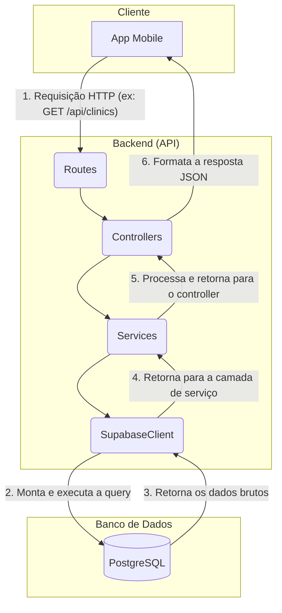

# Documentação do Projeto

Aqui está a documentação da arquitetura do banco de dados e do fluxo da API do projeto.

## 1. Diagrama de Fluxo da API

Este diagrama ilustra como uma requisição HTTP é processada pelas diferentes camadas do backend.



## 2. Detalhamento da API (Endpoints)

A seguir estão os detalhes de cada endpoint da API.

### Autenticação

Endpoints para registro e login de usuários (pacientes ou clínicas). O tipo de usuário é inferido pelos dados enviados.

---

#### `POST /api/auth/register`
Registra um novo paciente ou clínica.

**Corpo da Requisição (para Paciente):**
```json
{
  "nome": "João da Silva",
  "datan": "1990-05-20",
  "fone": "11987654321",
  "ende": "Rua Exemplo, 123",
  "email": "joao.silva@email.com",
  "senha": "senha_forte_123"
}
```

**Corpo da Requisição (para Clínica):**
```json
{
  "nome": "Clínica Saúde Plena",
  "endereco": "Avenida Principal, 456",
  "fone": "1133334444",
  "email": "contato@saudeplena.com",
  "senha": "outra_senha_forte",
  "imagem": "https://link.para/imagem.jpg"
}
```

**Resposta de Sucesso (`201 Created`):**
```json
{
  "message": "Usuário registrado com sucesso!",
  "user": {
    "codigo": 1,
    "nome": "João da Silva",
    "email": "joao.silva@email.com"
  }
}
```

---

#### `POST /api/auth/login`
Autentica um usuário e retorna um token de acesso.

**Corpo da Requisição:**
```json
{
  "email": "joao.silva@email.com",
  "senha": "senha_forte_123"
}
```

**Resposta de Sucesso (`200 OK`):**
```json
{
  "token": "eyJhbGciOiJIUzI1NiIsInR5cCI6IkpXVCJ9...",
  "user": {
    "codigo": 1,
    "nome": "João da Silva",
    "email": "joao.silva@email.com",
    "type": "paciente"
  }
}
```

**Resposta de Erro (`401 Unauthorized`):**
```json
{
  "message": "Email ou senha inválidos."
}
```

---
### Clínicas

Endpoints para gerenciar as clínicas.

---

#### `GET /api/clinics`
Retorna uma lista de todas as clínicas.

**Resposta de Sucesso (`200 OK`):**
```json
[
  {
    "codigo": 1,
    "nome": "Clínica Saúde Plena",
    "endereco": "Avenida Principal, 456",
    "fone": "1133334444",
    "email": "contato@saudeplena.com",
    "imagem": "https://link.para/imagem.jpg"
  }
]
```

---

#### `GET /api/clinics/:codigo`
Retorna uma clínica específica.

**Parâmetros da URL:**
- `codigo` (obrigatório): O ID da clínica.

**Resposta de Sucesso (`200 OK`):**
```json
{
  "codigo": 1,
  "nome": "Clínica Saúde Plena",
  "endereco": "Avenida Principal, 456",
  "fone": "1133334444",
  "email": "contato@saudeplena.com",
  "imagem": "https://link.para/imagem.jpg"
}
```

**Resposta de Erro (`404 Not Found`):**
```json
{
  "message": "Clínica não encontrada."
}
```

---

#### `POST /api/clinics`
Cria uma nova clínica (funcionalidade similar ao register, mas pode ser usada por um admin no futuro).

**Corpo da Requisição:**
```json
{
  "nome": "Clínica Nova",
  "endereco": "Rua Nova, 789",
  "fone": "1155556666",
  "email": "contato@clinicanova.com",
  "senha": "senha_segura",
  "imagem": "https://link.para/imagem_nova.jpg"
}
```

**Resposta de Sucesso (`201 Created`):**
```json
{
  "codigo": 2,
  "nome": "Clínica Nova",
  "email": "contato@clinicanova.com",
  ...
}
```

---

#### `PUT /api/clinics/:codigo`
Atualiza os dados de uma clínica.

**Parâmetros da URL:**
- `codigo` (obrigatório): O ID da clínica a ser atualizada.

**Corpo da Requisição:**
```json
{
  "nome": "Clínica Saúde Plena (Atualizada)",
  "fone": "1177778888"
}
```

**Resposta de Sucesso (`200 OK`):**
```json
{
  "codigo": 1,
  "nome": "Clínica Saúde Plena (Atualizada)",
  "fone": "1177778888",
  ...
}
```

---

#### `DELETE /api/clinics/:codigo`
Remove uma clínica.

**Parâmetros da URL:**
- `codigo` (obrigatório): O ID da clínica a ser removida.

**Resposta de Sucesso (`204 No Content`):**
- Nenhum conteúdo no corpo da resposta.

---
### Pacientes

Endpoints para gerenciar os pacientes.

---

#### `GET /api/patients`
Retorna uma lista de todos os pacientes.

**Resposta de Sucesso (`200 OK`):**
```json
[
  {
    "codigo": 1,
    "nome": "João da Silva",
    "datan": "1990-05-20T00:00:00.000Z",
    "fone": "11987654321",
    "ende": "Rua Exemplo, 123",
    "email": "joao.silva@email.com"
  }
]
```

---

#### `GET /api/patients/:codigo`
Retorna um paciente específico.

**Parâmetros da URL:**
- `codigo` (obrigatório): O ID do paciente.

**Resposta de Sucesso (`200 OK`):**
```json
{
  "codigo": 1,
  "nome": "João da Silva",
  ...
}
```

---

#### `PUT /api/patients/:codigo`
Atualiza os dados de um paciente.

**Parâmetros da URL:**
- `codigo` (obrigatório): O ID do paciente.

**Corpo da Requisição:**
```json
{
  "nome": "João da Silva Santos",
  "fone": "11999999999"
}
```

**Resposta de Sucesso (`200 OK`):**
```json
{
  "codigo": 1,
  "nome": "João da Silva Santos",
  "fone": "11999999999",
  ...
}
```

---

#### `DELETE /api/patients/:codigo`
Remove um paciente.

**Parâmetros da URL:**
- `codigo` (obrigatório): O ID do paciente.

**Resposta de Sucesso (`204 No Content`):**
- Nenhum conteúdo no corpo da resposta.

---
### Especializações

Endpoints para gerenciar as especializações médicas.

---

#### `GET /api/specializations`
Retorna uma lista de todas as especializações.

**Resposta de Sucesso (`200 OK`):**
```json
[
  { "codigo": 1, "nome": "Cardiologia" },
  { "codigo": 2, "nome": "Dermatologia" }
]
```

---

#### `POST /api/specializations`
Cria uma nova especialização.

**Corpo da Requisição:**
```json
{
  "nome": "Ortopedia"
}
```

**Resposta de Sucesso (`201 Created`):**
```json
{
  "codigo": 3,
  "nome": "Ortopedia"
}
```

---

#### `DELETE /api/specializations/:codigo`
Remove uma especialização.

**Parâmetros da URL:**
- `codigo` (obrigatório): O ID da especialização.

**Resposta de Sucesso (`204 No Content`):**
- Nenhum conteúdo no corpo da resposta.
