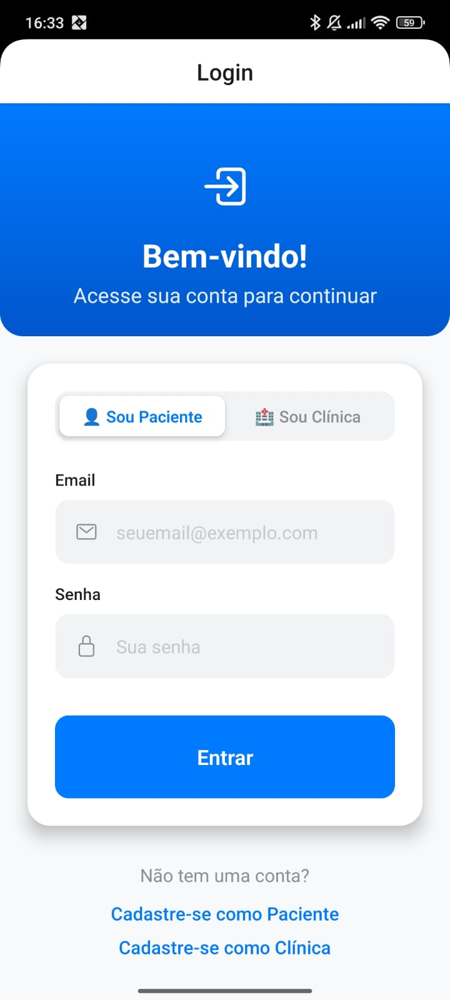
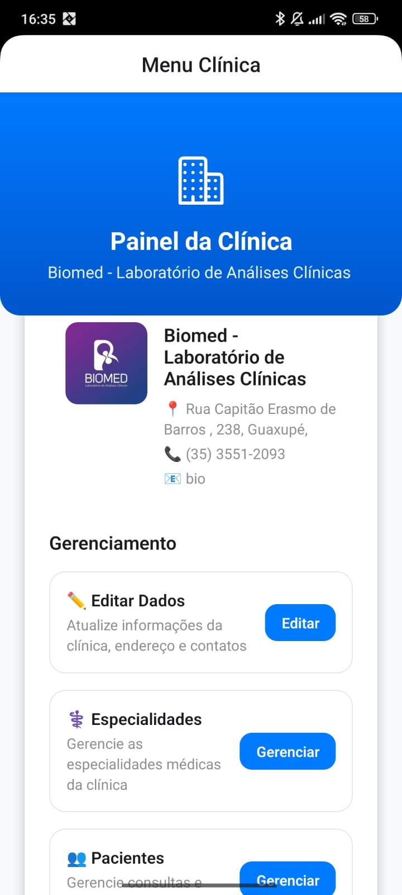
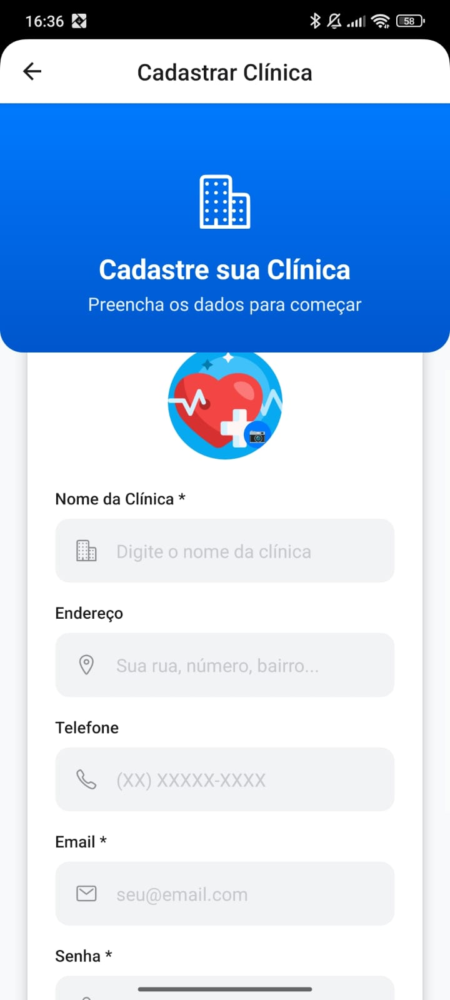

# 🏥 Sistema de Gerenciamento de Clínicas

Sistema completo para gerenciamento de clínicas médicas com interface mobile moderna e API robusta.

## 🎯 Problema

O gerenciamento de clínicas médicas frequentemente enfrenta desafios significativos:

- **Desorganização de informações**: Dados de pacientes e clínicas espalhados em diferentes sistemas
- **Dificuldade de acesso**: Falta de mobilidade para consultar informações importantes
- **Cadastros duplicados**: Ausência de controle centralizado de registros
- **Interface desatualizada**: Sistemas antigos com experiência do usuário deficiente
- **Comunicação ineficiente**: Dificuldade na comunicação entre clínicas e pacientes
- **Busca complexa**: Dificuldade para encontrar clínicas específicas ou especializações

## � Solução

Nossa aplicação resolve esses problemas através de um sistema integrado e moderno:

### **📱 Aplicativo Mobile Intuitivo**
- Interface moderna e responsiva construída com React Native
- Design system consistente com componentes reutilizáveis
- Navegação fluida entre diferentes módulos
- Experiência otimizada para dispositivos móveis

### **🔐 Sistema de Autenticação Dual**
- Login diferenciado para pacientes e clínicas
- Segurança na validação de credenciais
- Controle de acesso baseado em perfis

### **📊 Gerenciamento Centralizado**
- CRUD completo para clínicas e pacientes
- Sistema de especializações médicas
- Busca avançada e filtros inteligentes
- Sincronização em tempo real

### **🏗️ Arquitetura Robusta**
- API RESTful construída com Node.js e TypeScript
- Banco de dados Supabase para alta disponibilidade
- Padrão MVC para organização e manutenibilidade
- Clean Code para facilitar evolução do sistema

## 🌟 Utilidade

### **Para Clínicas Médicas:**
- **Gestão de perfil**: Manter informações atualizadas (endereço, telefone, especialidades)
- **Visibilidade**: Aparecer em buscas de pacientes procurando especialidades específicas
- **Comunicação**: Canal direto com pacientes através da plataforma
- **Credibilidade**: Perfil profissional com fotos e informações completas

### **Para Pacientes:**
- **Busca inteligente**: Encontrar clínicas por localização, especialidade ou nome
- **Informações completas**: Visualizar dados de contato, endereço e especialidades
- **Acesso móvel**: Consultar informações em qualquer lugar e momento
- **Interface amigável**: Navegação simples e intuitiva

### **Para Administradores:**
- **Controle total**: Gerenciar cadastros de clínicas e pacientes
- **Especializações**: Manter catálogo organizado de especialidades médicas
- **Relatórios**: Acompanhar crescimento e uso da plataforma
- **Manutenção**: Sistema organizado facilita atualizações e correções

## 🎨 Protótipo

### 📱 Interfaces do Aplicativo

<div align="center">

#### **Tela de Login**
<br>*Sistema de autenticação dual com seleção de perfil (Paciente/Clínica)*<br>
 
<br><br>
#### **Lista de Clínicas Disponíveis**
<br>*Busca inteligente com filtros por especialização médica*<br>
 
<br><br>
#### **Menu de Gerenciamento da Clínica**
<br>*Painel administrativo completo para clínicas médicas*<br>

<br><br>
#### **Cadastro de Paciente**
<br>*Formulário completo com validação de dados e formatação automática*<br>

<br><br>
#### **Cadastro de Clínica**
<br>*Sistema de registro com upload de imagem e dados institucionais*<br>


</div>


## 📊 Dados - Modelo de Entidade e Relacionamento (DER)

### **Entidades Principais:**

```
📋 PACIENTES
├── codigo (PK) - Chave primária
├── nome - Nome completo
├── datan - Data de nascimento
├── fone - Telefone de contato
├── ende - Endereço completo
├── email - Email (único)
└── senha - Senha criptografada

🏥 CLÍNICAS  
├── codigo (PK) - Chave primária
├── nome - Nome da clínica
├── endereco - Endereço completo
├── fone - Telefone de contato
├── email - Email (único)
├── senha - Senha criptografada
└── imagem - URL da imagem/logo

🎯 ESPECIALIZAÇÕES
├── codigo (PK) - Chave primária
└── nome - Nome da especialização

🔗 CLÍNICAS_ESPECIALIZAÇÕES (Relacionamento N:N)
├── codigo_clinica (FK) - Referência à clínica
└── codigo_especializacao (FK) - Referência à especialização
```

### **Relacionamentos:**

- **CLÍNICAS ←→ ESPECIALIZAÇÕES**: Relacionamento muitos-para-muitos
  - Uma clínica pode ter várias especializações
  - Uma especialização pode estar em várias clínicas
  - Implementado através da tabela associativa `clinicas_especializacoes`

- **PACIENTES**: Entidade independente para o sistema de autenticação e cadastro

### **Características do Banco:**

- **Chaves Primárias**: Auto-incrementais para todas as entidades
- **Integridade Referencial**: Foreign keys garantem consistência
- **Emails Únicos**: Previnem cadastros duplicados
- **Campos Opcionais**: Flexibilidade para informações não obrigatórias
- **Extensibilidade**: Estrutura permite fácil adição de novos campos

## 🛠️ Tecnologias Utilizadas

### **Frontend (Mobile)**
- **React Native** - Framework para desenvolvimento mobile
- **Expo SDK 54** - Plataforma de desenvolvimento
- **TypeScript** - Tipagem estática
- **React Navigation** - Navegação entre telas
- **Design System** - Componentes personalizados (ModernButton, ModernInput, ModernCard)

### **Backend (API)**
- **Node.js** - Runtime JavaScript
- **Express** - Framework web
- **TypeScript** - Tipagem estática
- **Supabase** - Backend-as-a-Service (BaaS)
- **CORS** - Middleware para requisições cross-origin

### **Banco de Dados**
- **PostgreSQL** - Banco relacional (via Supabase)
- **Supabase Auth** - Sistema de autenticação
- **Real-time** - Sincronização em tempo real

## 📁 Estrutura do Projeto

```
clinica-app/
├── mobile/                  # Aplicativo React Native
│   ├── src/
│   │   ├── components/      # Componentes reutilizáveis
│   │   ├── screens/         # Telas da aplicação
│   │   ├── navigation/      # Configuração de navegação
│   │   ├── styles/          # Sistema de design e temas
│   │   ├── api/            # Cliente da API
│   │   └── types/          # Tipos TypeScript
│   └── App.tsx
├── backend/                 # API RESTful
│   ├── src/
│   │   ├── controllers/     # Controladores MVC
│   │   ├── services/        # Lógica de negócio
│   │   ├── routes/          # Definição de rotas
│   │   ├── types.ts         # Tipos da API
│   │   └── index.ts         # Servidor principal
│   └── migrations/          # Scripts do banco
└── README.md
```

## 🚀 Como Executar o Projeto

### **📱 Mobile (React Native)**

```bash
# Navegar para a pasta mobile
cd mobile

# Instalar dependências
npm install

# Executar no simulador iOS
npm run ios

# Executar no simulador Android
npm run android

# Executar no Expo Go
npm start
```

### **🔧 Backend (API)**

```bash
# Navegar para a pasta backend
cd backend

# Instalar dependências
npm install

# Configurar variáveis de ambiente (.env)
SUPABASE_URL=sua_url_do_supabase
SUPABASE_ANON_KEY=sua_chave_anonima
PORT=3000

# Executar em desenvolvimento
npm run dev

# Build para produção
npm run build && npm start
```

## � Funcionalidades da API

### **🔐 Autenticação** (`/auth`)
- `POST /auth/login` - Login dual (pacientes/clínicas)
- `POST /auth/register` - Cadastro de usuários

### **🏥 Clínicas** (`/clinics`)
- `GET /clinics` - Listar clínicas
- `GET /clinics/:codigo` - Buscar clínica específica
- `POST /clinics` - Cadastrar clínica
- `PUT /clinics/:codigo` - Editar clínica
- `DELETE /clinics/:codigo` - Remover clínica

### **👤 Pacientes** (`/patients`) 
- `GET /patients` - Listar pacientes
- `GET /patients/:codigo` - Buscar paciente específico
- `POST /patients` - Cadastrar paciente
- `PUT /patients/:codigo` - Editar paciente
- `DELETE /patients/:codigo` - Remover paciente

### **🎯 Especializações** (`/specializations`)
- `GET /specializations` - Listar especializações
- `POST /specializations` - Criar especialização
- `DELETE /specializations/:codigo` - Remover especialização

## 🎯 Objetivos do Projeto

- **Acadêmico**: Projeto de TCC demonstrando conhecimentos em desenvolvimento full-stack
- **Prático**: Solução real para gerenciamento de clínicas médicas
- **Tecnológico**: Implementação de tecnologias modernas e boas práticas
- **Social**: Facilitar acesso à informação médica e melhorar comunicação

## 🛠️ Resolução de Problemas

### Backend não conecta com Supabase
- Verifique se as credenciais no `.env` estão corretas
- Teste a conexão com internet

### Mobile não conecta com backend
- Verifique se o IP no `src/api/client.ts` está correto
- Confirme se o backend está rodando na porta 4000
- Use o IP da rede local, não localhost

### Erros de dependências
```bash
# Limpar node_modules e reinstalar
rm -rf node_modules package-lock.json
npm install
```

## 📝 Endpoints da API

- `GET /` - Status da API
- `POST /auth/login` - Login
- `POST /auth/register` - Registro
- `GET /patients` - Listar pacientes
- `POST /patients` - Criar paciente
- `GET /clinics` - Listar clínicas
- `POST /clinics` - Criar clínica
- `GET /specializations` - Listar especializações

---

**Projeto desenvolvido para fins acadêmicos - Não usar em produção**